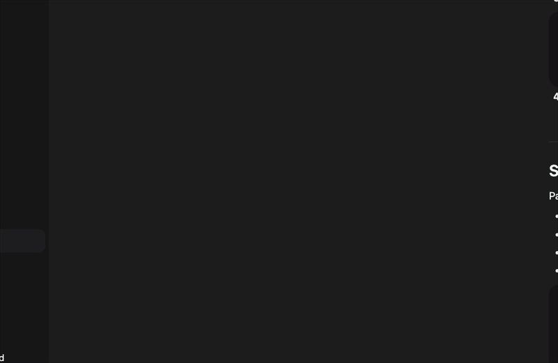

# AI GTM Case-Study Generator

Turn before/after GTM metrics + screenshots into a polished one-page case study (Markdown CLI).

   


_Short demo: init a sample, then generate a one-page Markdown case study._

**⭐ Star this repo if it helps you ship proof faster.**

### Why this exists
- faster proof for GTM/sales enablement
- consistent storytelling
- generates evidence from YAML

### Install (pipx)

```bash
pipx install git+https://github.com/TheArcitect/ai-gtm-case-study.git
gtm-casegen --help
```

### Quickstart

```bash
gtm-casegen init --dir examples
gtm-casegen generate --input examples/case.yaml --out out/
```

### Sample Output (excerpt from `out/case-study.md`)

```markdown
# AI-Accelerated Pipeline Lift

**Timeframe:** Q2 2025  
**Customer:** B2B SaaS scale-up, North America

## Results
- 32% increase in qualified meetings per rep/week
- Ramp time reduced from 28 → 19 days
- Qualified rate improved from 22% → 29%
```

### Use cases / keywords
- AI GTM, sales enablement, case study generator, markdown, CLI, before/after metrics

### Roadmap
- PDF export
- Multiple templates
- CSV input
- Charts

### Contributing
Issues and PRs are welcome. Please run the test suite and linter locally before submitting.

### Detailed module README
Detailed module README → `gtm-casegen/README.md`

### Repo assets
- `assets/demo.gif` is referenced above. Replace with a real 30–60s recording of `init → generate`.
- Set `assets/social-preview.png` as the GitHub Social Preview image (in repo Settings).

---

### Next steps
- [ ] Add repo Topics: ai, go-to-market, case-study, cli
- [ ] Replace `assets/demo.gif` with a 30–60s recording of init → generate
- [ ] Set `assets/social-preview.png` in GitHub → Settings → Social preview
